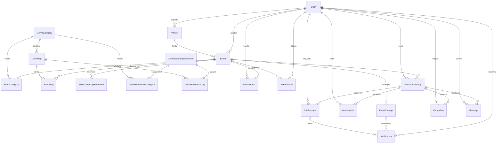

# Database schema

Agreed design recorded September 27, 2026. Documentation only: Django models, migrations, and enforcement are not implemented yet. This is the target for implementation and the eventual database diagram; update both together if it changes.

## Conventions and ownership

One SQLite database, accessed through Django ORM. Each entity has an integer primary key `id`. Foreign keys below reference these IDs. Required unless marked optional. All datetimes are timezone-aware in Python and normalized to UTC for storage; venues retain an IANA timezone name for local input/display. Text is plain text; URLs accept HTTP/HTTPS only. Proposed maximum lengths are implementation specifications, not additional product features.

`accounts` supplies Django-based identity; `discovery` owns classification, locations, events, references, reports, follows, and event changes; `groups` owns social coordination. A small shared `notifications` module connects event changes and group offers to recipients. These modules remain one monolith, not additional deployed services.

## Accounts

### User

Use a project user model based on Django's standard user, declared before initial migrations, rather than replacing password/session machinery.

| Field | Type / rule |
|---|---|
| username | Unique string, 150 characters |
| password | Django-managed password hash; never plaintext |
| display_name | Optional string, 80 characters; display falls back to username |
| email | Optional email, 254 characters; private; not a login identifier or verified address |
| is_active, is_staff, is_superuser | Django account/admin flags |
| date_joined, last_login | Django timestamps; last_login optional |

Keep standard Django permission relationships. No profile photos, public email, email verification, recovery workflow, or attendance/RSVP record is introduced. Accounts are normally deactivated, not deleted. Account email appears only to its owner and authorized administration.

## Discovery

### GenreCategory and GenreTag

| Object | Fields |
|---|---|
| GenreCategory | `name` unique string(80), `color` hex string(7), `description` text, `display_order` nonnegative integer default 0, optional `bpm_min`/`bpm_max` positive integers |
| GenreTag | `category` FK, `name` string(80), `description` text, optional `bpm_min`/`bpm_max` positive integers; unique `(category, name)` |

Admins curate both. Categories determine pin colors (e.g. Rock, House, DnB); tags add detail (e.g. Metal, Afrohouse). More than one tag per event is allowed even for a single-event pin. Shapes/textures are not stored until their meaning is decided. Names are trimmed and duplicates differing only in case rejected by validation.

BPM pairs must be either both absent or both present, with `0 < bpm_min <= bpm_max`. For each event category, use ranges of selected tags when known; fall back to the category range for tags without a range, or when no tags are selected. Combine contributing ranges by lowest minimum/highest maximum. If a selected musical component has neither a tag range nor category fallback, display “Varies” instead of presenting an incomplete range as comprehensive. Display “Typical tempo estimate”, not a measured performance tempo. Do not store an event BPM field; derive it from current curated data. Artists/AI-based classification is future work, not an integration or schema requirement now.

### Venue

| Field | Type / rule |
|---|---|
| name | String(160); not globally unique |
| address | Optional text |
| latitude, longitude | Numeric; latitude -90 to 90, longitude -180 to 180 |
| timezone | String(64), validated IANA timezone |
| submitted_by | User FK |
| review_status | `pending` (default), `approved`, `rejected` |
| reviewed_by, reviewed_at | Optional admin User FK and datetime |
| review_note | Optional text |
| created_at, updated_at | Datetimes |

Users select an approved venue or propose a new one by name and map position. Only admins edit shared approved venue details. Selecting another venue changes an event's FK, not the original venue. Approval is reusable location review, not a guarantee about every event held there. Pending/rejected venues cannot expose their events on the public map. Coordinates need not be globally unique: different spaces can share a building.

### Event

| Field | Type / rule |
|---|---|
| creator | User FK |
| venue | Venue FK |
| title | String(200) |
| description | Text |
| starts_at, ends_at | Datetimes; end strictly after start |
| ticket_url | Optional URL, 2048 characters |
| cancelled_at | Optional datetime; populated means cancelled |
| moderation_hidden | Boolean, default false |
| created_at, updated_at | Datetimes |
| categories | Many-to-many GenreCategory through EventCategory |
| tags | Many-to-many GenreTag through EventTag |

`EventCategory(event, category)` and `EventTag(event, tag)` each have a unique FK pair. Require at least one category when publishing; every selected tag's category must also be selected. This minimum/category consistency is a business rule enforced when saving the complete edit, not a simple row CHECK.

Only creator/admin edits an event. Public upcoming results require approved venue, no moderation hiding, no cancellation, and overlap with the selected time window. Proposed overlap convention: `starts_at < window_end` and `ends_at > window_start`, so overnight/ongoing events remain discoverable. Date controls translate local calendar boundaries to UTC; exact frontend timezone controls remain implementation work.

Cancellation preserves details and groups, with a cancelled label; hidden/unapproved event details and coordinates must not become publicly accessible by guessing URLs. Authorized creator/admin views may show pending details. Changing to an approved venue does not clear moderation hiding. Cancellation is event-specific, not a red X over every event at that venue.

### Listening references

| Object | Fields |
|---|---|
| EventListeningReference | `event` FK, `title` string(200), `artist_credit` string(200), `url` URL(2048), `kind` (`track`, `set`, `artist_page`), `display_order` nonnegative integer |
| GenreListeningReference | Same descriptive fields, without event FK; many-to-many `categories` and optional `tags` |

Use unique pairs in `GenreReferenceCategory(reference, category)` and `GenreReferenceTag(reference, tag)`. Require at least one category and category/tag consistency for curated examples. Event references inherit event musical context. Admin-managed examples and creator-managed event links are separate so an event edit cannot alter the shared directory. Artist credit is descriptive text, not a performer database or verified lineup. There are no hosted audio files.

### EventReport

`event` FK, `reporter` User FK, `reason` (`incorrect_information`, `spam_scam`, `safety_concern`, `other`), optional `explanation` text, `status` (`pending`, `dismissed`, `actioned`), `created_at`, optional `reviewed_by` User FK, `reviewed_at`, and `resolution_note` text.

Reports trigger admin review, never automatic removal. Status resolution records handling; hiding/deactivation is an explicit authorized action. Reports/review notes are not public event metadata.

### EventFollow

`user` FK, `event` FK, `created_at`; unique `(user, event)`. Unfollow deletes this relationship. Following is independent of membership and attendance, and does not create an RSVP.

### EventChange

`event` FK, `actor` User FK, `created_at`, `kind` (`event_edit`, `venue_details_edit`), `changes` structured JSON snapshot.

One record per relevant saved edit. `changes` contains whitelisted keys only, each with `before` and `after`: venue (ID/name/address/coordinates/timezone snapshot), starts_at, ends_at, and cancelled state. Only changed keys are included. Dates use ISO UTC values. JSON keeps a multi-field edit together without many mostly empty columns; its schema must be validated in business logic. This is the detailed representation of the agreed old/new change history, not a free-form metadata store.

Notify current followers when venue, event times, or cancellation changes. Approved shared venue location/timezone changes must also generate affected-event change records so admin edits cannot silently bypass tracking. Do not include unapproved new coordinates in ordinary notifications: tell followers the location changed and is awaiting review. Editing and notification creation belong to one transaction. Neither ticket prices nor deals are tracked now.

## Groups

Groups appear under “Attending alone?” for users actively seeking company. They are optional: attending, browsing, following, and ticket purchase do not require membership.

### AttendanceGroup

`event` FK, `owner` User FK, `name` string(120), `description` text, `capacity` positive integer (includes owner), `joining_mode` (`public`, `approval_required`), optional `photo` file path, `created_at`, `updated_at`.

All groups are discoverable where their event is publicly visible; messages are not. Store image files under the configured data directory, not image bytes in SQLite. Validate file type/size; exact limits/library remain to select. Group's event cannot be reassigned after creation.

### Membership

`group` FK, `user` FK, `joined_at`; unique `(group, user)`. Membership rows represent current membership only; leaving removes the row. A user may belong to only one group for a particular event. Event is derived through group rather than duplicated here.

The cross-group event rule requires transactional business logic, not merely `(group,user)` uniqueness. All joins, approvals accepted, removals, capacity edits, bans, and switches must use the same guarded write path. SQLite concurrency handling and retries must preserve that invariant; do not assume row-level locking is available or rely on a form check alone.

### JoinRequest

`group` FK, `applicant` User FK, `status` (`pending`, `approved`, `rejected`, `accepted`, `cancelled`), `requested_at`, optional `reviewed_by` User FK, `reviewed_at`, `accepted_at`.

Keep attempts as history; at most one unresolved (`pending` or `approved`) request per `(group, applicant)` through a conditional uniqueness constraint. Rejected/removed applicants may request again unless banned. Applicants may cancel pending/approved offers. Approvals do not create memberships or reserve capacity.

### GroupBan

`group` FK, `user` FK, `issued_by` User FK, optional `reason` text, `issued_at`, optional `lifted_at` and `lifted_by` User FK. At most one active ban per group/user. Keep lifted bans as history. Owners/admins issue/lift bans; banning removes existing membership and cancels unresolved requests. General user-to-user blocking is out of scope.

### Message

`group` FK, `author` User FK, `body` text, `created_at`, optional `edited_at`, `deleted_at`, and `deleted_by` User FK. Non-deleted messages require nonempty text. On deletion, clear body and retain a tombstone with deletion metadata; do not retain edit history/deleted text.

Only current members read/post. Authors may edit/delete their own messages while authorized to access the group; admins can remove messages. Group owners cannot edit/delete others' messages just because they own the group. No attachments or live delivery.

### Atomic membership behavior

1. Creator becomes a member and counts toward capacity.
2. Approval sends an offer notification. Applicant may already belong to another group for that event.
3. Accept/join checks account state, ban, event/group availability, and current capacity. If already in another group, require explicit switch confirmation.
4. Remove old membership and create new membership in one transaction. A failed destination check leaves the original membership intact. Concurrent acceptances must not overfill a group.
5. Owner departure transfers ownership to earliest remaining `joined_at`, breaking ties by membership ID. Rejoining creates new seniority.
6. If no members remain, delete the group and its dependent records; clean up its photo after successful database commit. No ownerless group remains.
7. Lowering capacity below current membership count is rejected. Removal allows rejoining; banning prevents it.

Exact cutoff for joining after an event starts and post-event message retention remain explicit implementation follow-ups, not invented confirmed requirements. Cancelled/hidden events must not gain new public group participation; existing authorized members need a view of cancellation/change status.

## Notifications

### Notification

`recipient` User FK, `kind` (`event_change`, `group_offer`), optional `event_change` FK, optional `join_request` FK, `summary` text, `created_at`, optional `read_at`.

Exactly one relevant source at creation, consistent with kind. Unique `(recipient,event_change)` and `(recipient,join_request)` prevent duplicate notifications for a source. Deleting a group removes its request-offer notifications along with requests, avoiding broken offers. Event history is retained. Recipients alone can read/mark their own notifications. Group approval notices do not imply reserved membership.

Delivery is in-app on load/refresh. Phone push, browser banners/push, email, price/deal alerts, queues, and background workers are deferred. No generic foreign-key mechanism is needed for the two known types.

## Integrity, deletion, and indexes

- DB constraints: FKs; unique relationships; valid coordinate ranges, time order, BPM pairs, positive capacity; conditional uniqueness for unresolved requests/active bans; notification source consistency.
- Domain validation: category minimum/tag parent consistency, URL schemes, timezone names, permissions, image validation, and allowed state transitions.
- Transactional invariants: one group per event per user, capacity, membership/owner handover, group switching, moderation and notification creation. Direct admin actions must use these same rules.
- Protect referenced accounts, venues, categories, and events from accidental hard deletion. Normal actions deactivate users, review venues, hide/cancel events. Events with groups/history are retained.
- Group hard deletion cascades memberships, requests, bans, messages, and dependent offer notifications. Removing a follow or tag association affects only that link. Removing a listening reference does not delete its event/category.
- FK and unique indexes support relationships. Add indexes for event time-window lookup, venue review status, group/event lookup, `(group,created_at)` messages, `(recipient,read_at,created_at)` notifications, and pending reports/requests. Confirm actual indexes/query behavior during implementation rather than adding speculative optimization.
- Pin counts, gradients, tempo estimates, membership counts, and inferred availability are derived, not independent stored fields.

## Relationship diagram

Main entities and relationships; FK reviewer/actor aliases and Django internal permission/session tables are omitted for readability. Field tables above specify their attributes. Many-to-many links correspond to the explicit unique-pair tables described above.

## Implementation handoff

Next chunk: create Django skeleton and initial models/migrations matching this specification; select runtime dependencies, verify schema constraints, and update this document to match actual models. The final report's schema diagram must show actual table columns and relationships, not merely reuse a planning diagram. Testing strategy/ADR-4 remains deferred, with the assignment's coverage requirement unchanged.
